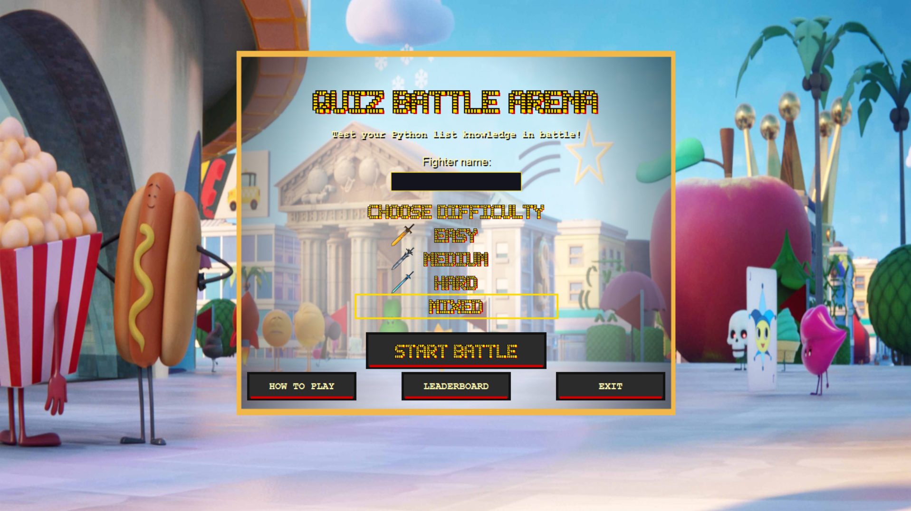
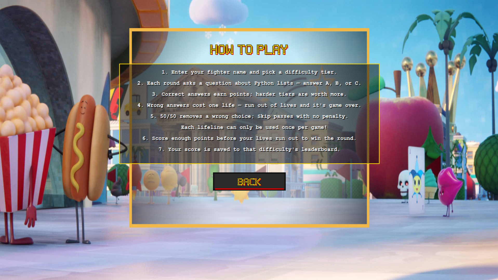
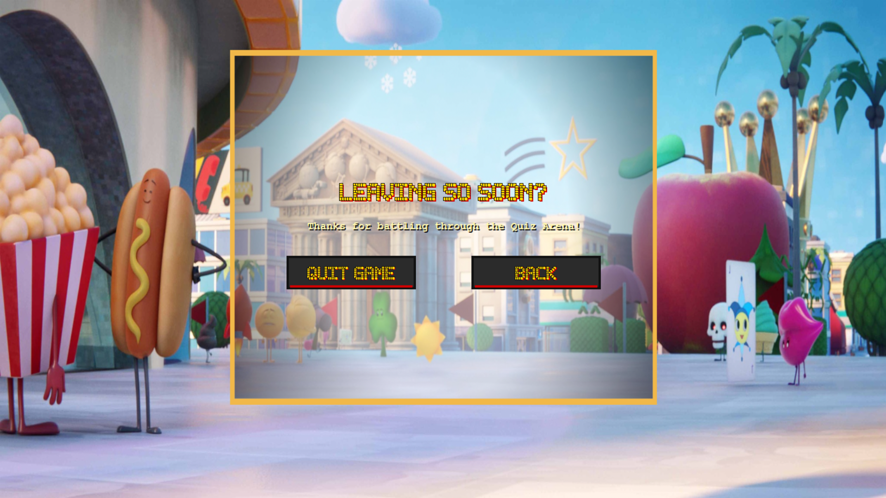
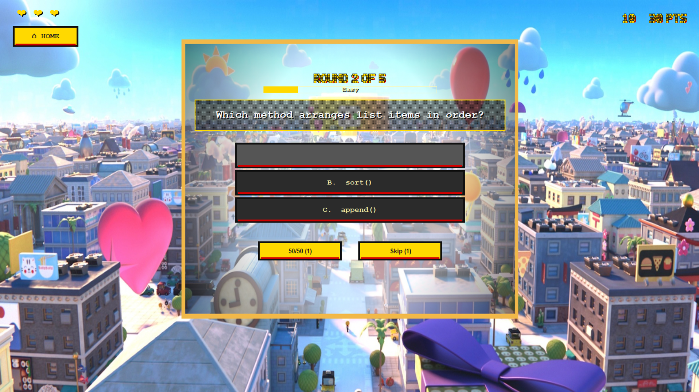
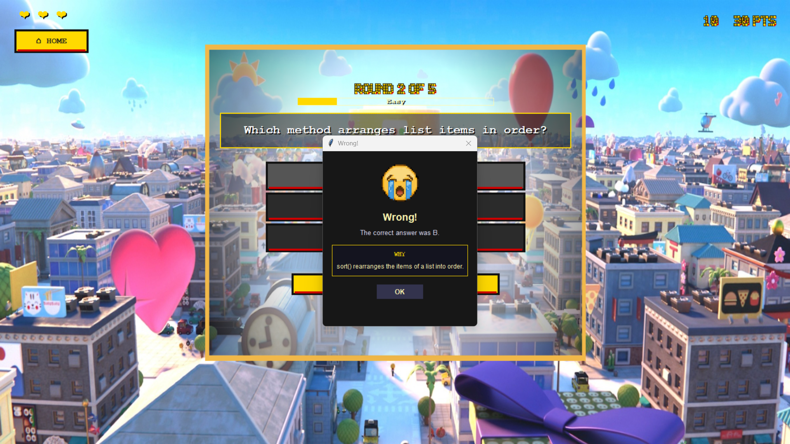
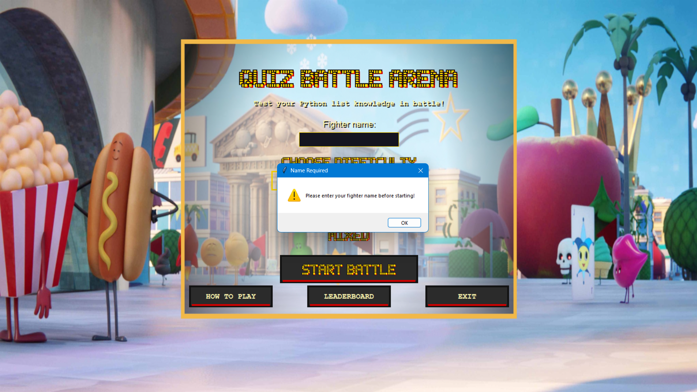
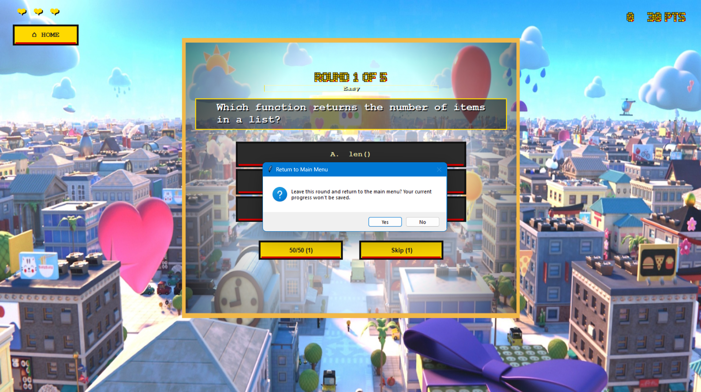
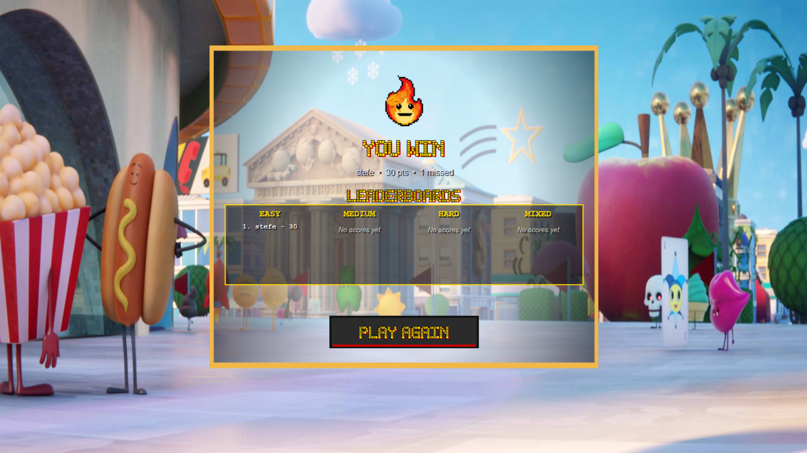
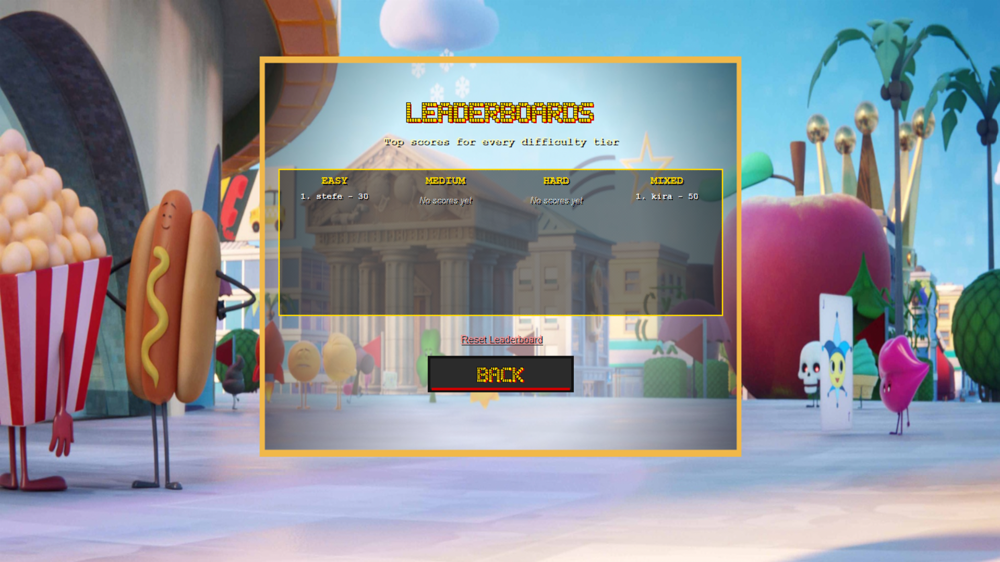
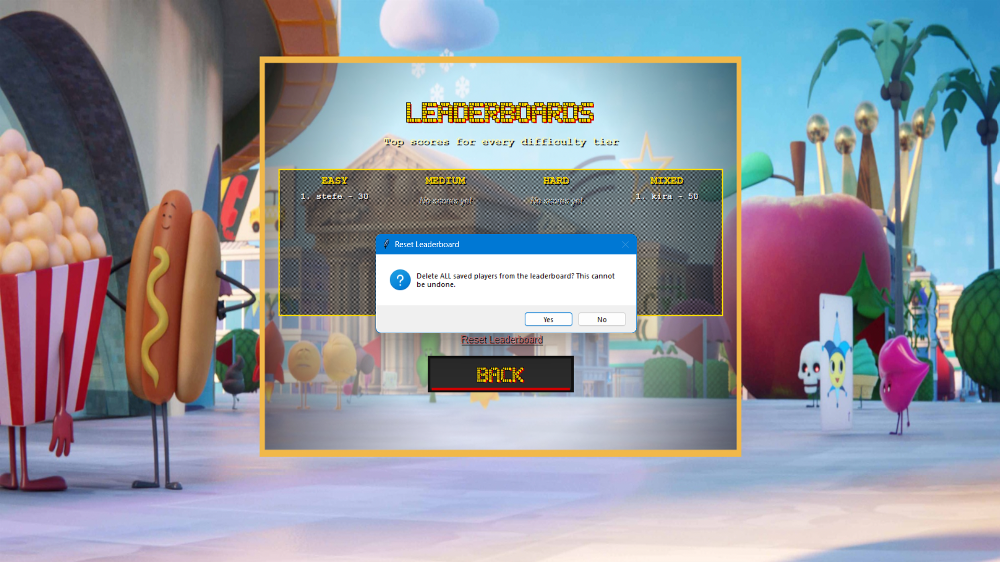

# Quiz Battle Arena

A console (and optional GUI) quiz game built for the DSA Prelim Group Project. Answer trivia questions about Python lists to defeat the Arena — pick a difficulty, manage your lives, and use lifelines wisely.

> Originally a repetitive, list-free starter script. Rebuilt to use Python lists as the core data structure for questions, scoring, lifelines, and rankings.

---

## Team — Group 2

| Name | Role | Contribution |
|---|---|---|
| _Stefe Kira R. Albarece_ | Game Producer / Team Leader | Planned the transformation, assigned roles, integrated final build |
| _Stefe Kira R. Albarece_ | Lead Game Programmer | Built `engine.py` core loop, question list structure, player state |
| _Dianne Beatrice Al Kasem_ | Gameplay and Logic Programmer | Implemented lifelines, difficulty filtering, scoring, input validation |
| _Antonette Hian Serato_ | Assistant Gameplay and Logic Programmer; Documenter| Implemented lifelines, difficulty filtering, scoring, input validation, flowchart |
| _Trisha Mae Poligrates_ | Game/UI Designer and Writer | Wrote title screen, instructions, GUI layout (`gui.py`) |
| _Pepito Sia III_ | QA Tester and Documentation Lead | Test cases, bug fixes, README, screenshots, demo |

---

## How to Run

1. Install Python 3 from [python.org](https://python.org) if you don't already have it.
2. Download `game.py`, `engine.py`, `gui.py`, and `gui_pixel.py` into the **same folder**, along with the `images/` and `sounds/` folders.
3. Open a terminal in that folder.
4. Run the console version (this is the required submission):
   ```
   python game.py
   ```
5. (Optional) Run the pixel-art GUI version:
   ```
   python gui_pixel.py
   ```
   Requires:
   - `tkinter`, which ships with Python by default. On some Linux distributions, install it separately with `sudo apt install python3-tk`.
   - `Pillow`, for loading the background art and icons: `pip install Pillow`
   - `pygame`, for background music and sound effects: `pip install pygame`

   If Pillow or pygame aren't installed, or the `images/`/`sounds/` folders are missing, the GUI still runs — it just falls back to plain colors and silence instead of crashing (check the terminal for `[DEBUG]` lines explaining what wasn't found).

---

## How to Play

1. Enter your fighter name.
2. (Optional) Click **HOW TO PLAY** on the title screen for an in-app rules summary, or **LEADERBOARD** to see top scores for every difficulty.
3. Choose a difficulty: Easy, Medium, Hard, or Mixed. Each tier changes the number of rounds, starting lives, and points per question.
4. Answer each question about Python lists (A/B/C).
   - Correct answers earn points based on difficulty (Easy = 10, Medium = 15, Hard = 20).
   - Wrong answers cost one life.
   - Every answer — right or wrong — shows a short explanation of why that's the correct choice.
5. Use lifelines when stuck:
   - `5050` — removes one incorrect choice (usable once per game)
   - `SKIP` — skips the question with no penalty (usable once per game)
6. Click the **⌂ HOME** button any time during a question to bail out to the main menu (with a confirmation, since it forfeits the current round).
7. Survive with enough points to win the round. Your score is added to that difficulty's leaderboard.
8. Choose to play again or exit.

---

## Game Features

- Title screen with name input, difficulty selector, and a **How To Play**, **Leaderboard**, and **Exit** menu
- In-app instructions screen
- 5–15 rounds per playthrough depending on difficulty (expandable — see `QUESTIONS` list)
- Health (lives) and score system
- Difficulty selection that changes the question pool, round length, starting lives, and points per question
- Two single-use lifelines that meaningfully affect gameplay
- A short "why" explanation shown after every answer
- Win and lose conditions
- A dedicated Home button to abandon a round mid-question, with confirmation
- Play-again loop
- Input validation (rejects anything other than A/B/C or an available lifeline; blocks starting with an empty name)
- End-of-game summary with missed topics and leaderboard display
- Looping background music with dedicated correct/wrong/win/lose sound effects (GUI only)
- Optional Tkinter GUI (plain and pixel-art versions) that share the exact same game logic as the console version

---

## Python List Operations Used

| Requirement | Where it's used |
|---|---|
| 4+ meaningful lists | `QUESTIONS`, `leaderboard`, `wrong_answers`, `available` (in `build_round_questions`) |
| Nested list | Each question is a list `[question, A, B, C, correct, difficulty, explanation]` inside `QUESTIONS` |
| `append()` in gameplay | `wrong_answers.append(...)`, `leaderboard.append(...)` |
| `pop()` in gameplay | `available.pop()` selects each round's question from the pool |
| Traversal | `for question_data in round_questions` |
| List indexing | `question_data[0]`, `question_data[4]`, `question_data[5]`, `question_data[6]`, etc. |
| Search | `search_wrong_topics()` scans missed questions for a keyword |
| `sort()` / `sorted()` | `get_ranked_leaderboard()` ranks scores highest to lowest |
| `len()` | `len(wrong_answers)`, `len(round_questions)`, `len(question_pool)` |
| List display | `show_leaderboard()` / GUI Leaderboard screen; end-of-game missed-topics list |
| List comprehension (filtering) | `filter_by_difficulty()` builds a sub-list by difficulty tier |

---

## Project Structure

```
game.py           - Console version (run this to play — required submission)
engine.py         - Shared game logic and data (questions, lifelines, leaderboard)
gui.py            - Optional plain Tkinter GUI version (uses engine.py, same lists)
gui_pixel.py      - Optional pixel-art Tkinter GUI version (uses engine.py, same lists)
leaderboard.json  - Saved leaderboard data (auto-created/updated by the game)
images/           - Background art and icons used by the GUI versions
sounds/           - bgmusic.mp3, bgmusic_correct.mp3, bgmusic_wrong.mp3,
                    bgmusic_win.mp3, bgmusic_lose.mp3 (used by gui_pixel.py)
docs/
  flowchart_overview.png   - Program flowchart 
  flowchart_question_loop.png   - Program flowchart 
  test-cases.md   - Full manual test log
```

---

## Adding Your Own Questions

Open `engine.py` and edit the `QUESTIONS` list. Each entry follows this format:

```python
["question text", "choice A", "choice B", "choice C", "correct letter", "difficulty", "explanation"]
```

Difficulty must be `"Easy"`, `"Medium"`, or `"Hard"`. The `explanation` is shown to the player after they answer, so keep it to one clear sentence.

---

## Test Cases

See [`docs/test-cases.md`](docs/test-cases.md) for the full test log (33 cases covering core gameplay, persistence, GUI navigation, audio, and visual readability). Summary:

| Test | Steps | Expected Result | Status |
|---|---|---|---|
| Invalid answer input | Type a letter outside A/B/C | Game reprompts, does not crash | ✅ |
| 50/50 lifeline | Use `5050` mid-question | One wrong choice hidden, cannot be reused | ✅ |
| Skip lifeline | Use `SKIP` mid-question | Moves to next question, no life lost, cannot be reused | ✅ |
| Health reaches 0 | Answer wrong until lives run out | Game ends immediately, shows GAME OVER | ✅ |
| Win condition | Score at/above the win threshold with lives remaining | Shows YOU WIN! | ✅ |
| Small question pool | Choose a difficulty with fewer questions than the round length | Round shortens instead of crashing | ✅ |
| Leaderboard sorting | Play multiple rounds with different scores | Leaderboard sorted highest to lowest | ✅ |
| Home button mid-question | Click Home, confirm | Returns to the main menu without crashing, round not saved | ✅ |
| Background music resumes correctly | Answer a question | Music pauses for the stinger, then resumes from where it left off (not from 0:00) | ✅ |
| Play again | Answer "n" at the play-again prompt / click PLAY AGAIN | Game exits cleanly (console) / returns to title with fresh music (GUI) | ✅ |

---

## Screenshots

| | |
|---|---|
| **Title / Home screen** |  |
| **How To Play** |  |
| **Leaderboard screen** |  |
| **Exit screen** |  |
| **50/50 lifeline in use** |  |
| **Correct answer popup** |  |
| **Wrong answer popup** |  |
| **Valid input** |  |
| **Invalid input handling** |  |
| **Return-to-home confirmation** |  |
| **Win screen** |  |
| **Game Over screen** |  |
| **Leaderboard updated after a game** |  |
| **Reset leaderboard confirmation** |  |

---

## Flowchart

Split into two diagrams for readability:
- [`docs/flowchart_overview.png`](docs/flowchart_overview.png) — the big picture: title screen, menu options, one round of play, result, and play-again loop.
- [`docs/flowchart_question_loop.png`](docs/flowchart_question_loop.png) — zoomed into what happens for a single question: lifelines, answering, scoring, and the explanation shown afterward.

---

## Gameplay Demo\n[Watch the demo video](https://youtu.be/FlMl-wWMEEs) 

---

## Creativity Additions

- Difficulty tiers (Easy / Medium / Hard / Mixed) with scaled points, round counts, and starting lives
- Two lifelines: 50/50 and Skip
- Expanded question bank (45 questions across three difficulty tiers, randomly sampled each playthrough)
- A short explanation shown after every answer, correct or wrong
- Looping background music with dedicated correct/wrong/win/lose sound effects
- A dedicated Home button to leave a round mid-question
- In-app How To Play, Leaderboard, and Exit screens
- Two optional Tkinter GUIs (a plain version and a pixel-art version) sharing the same game engine as the console version
